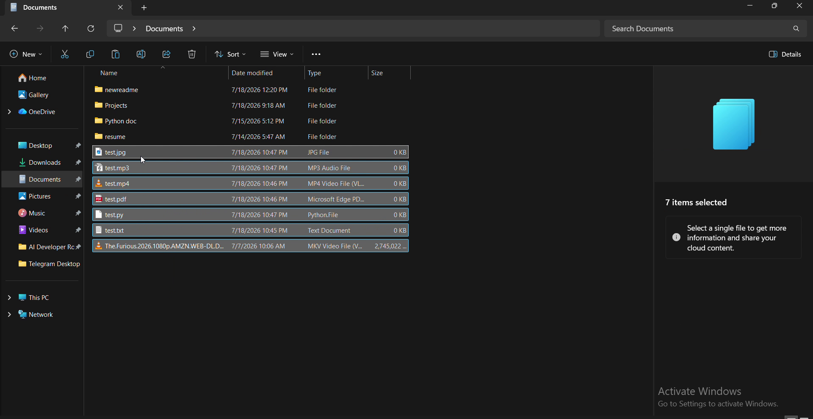

# Smart File Organizer Pro

A lightweight Windows desktop automation tool that watches your **Downloads**
folder (and **Downloads/Telegram Desktop**) and automatically sorts new
files into tidy category folders — safely, continuously, and without a GUI.

---

## Features

- 👀 Watches **Downloads** and **Downloads/Telegram Desktop** at the same time
- 🗂️ Auto-creates and sorts files into `Images`, `Videos`, `Documents`, `Music`, `PDFs`, `Others`
- ⏳ Waits for downloads to fully finish before moving anything (no corrupted moves)
- 🚫 Skips browser temp files (`.crdownload`, `.part`, `.tmp`, `.download`)
- 🔒 Skips installers/archives (`.exe`, `.msi`, `.zip`, `.rar`, `.7z`, `.iso`, `.cab`, `.apk`) — left in place, untouched
- 🙈 Never touches folders, hidden files, or system files
- 🔁 Automatic retry on Windows file locks (`PermissionError`) — never crashes
- 🧬 Windows Explorer-style duplicate handling: `photo.jpg` → `photo (1).jpg` → `photo (2).jpg`
- 🌈 Colored console output (falls back to plain text automatically)
- 📝 Full logging to `logs/organizer.log`
- ♾️ Runs continuously until you stop it (`Ctrl+C`)

---

## Installation

**Requirements:** Python 3.13+ on Windows.

```bash
pip install -r requirements.txt
```

That's it — the only third-party dependency is [`watchdog`](https://pypi.org/project/watchdog/).

---

## Usage

```bash
python main.py
```

The program will:
1. Create the destination folders inside `Downloads` if they don't already exist.
2. Start watching `Downloads` and `Downloads/Telegram Desktop`.
3. Move any new, fully-downloaded file into the correct category folder.
4. Keep running until you press `Ctrl+C`.

Log output is printed to the console and appended to `logs/organizer.log`.

### Optional: Run automatically at Windows login

Startup registration ships **disabled by default**. To enable it:

1. Open `startup.py`
2. Set `STARTUP_REGISTRATION_ENABLED = True`
3. Run `python startup.py`

This drops a small launcher script into your Windows Startup folder. To remove it later,
call `unregister_startup()` from the same file.

---
## 🎥 Project Demo

[](./demo.mp4)

## Folder Structure

```text
SmartFileOrganizer/
│
├── main.py          # Entry point — starts everything
├── watcher.py        # watchdog Observer setup, monitors both folders
├── organizer.py       # Core logic: decide + safely move each file
├── config.py         # All configurable values (paths, extensions, timing)
├── logger.py          # Colored console + rotating file logging
├── utils.py           # Stability checks, duplicate naming, safety helpers
├── startup.py         # Optional Windows Startup registration (disabled)
├── requirements.txt
├── README.md
│
├── logs/
│   └── organizer.log
│
└── .gitignore
```

---

## Supported File Types

| Category  | Extensions |
|-----------|------------|
| Images    | jpg, jpeg, png, bmp, gif, webp, svg, tiff, ico, heic |
| Videos    | mp4, mkv, avi, mov, wmv, flv, webm, mpeg, mpg, 3gp |
| Documents | txt, doc, docx, xls, xlsx, ppt, pptx, csv, json, xml, md, rtf, odt, ods, odp |
| PDFs      | pdf |
| Music     | mp3, wav, aac, ogg, flac, m4a |
| Others    | any extension not listed above |

**Never moved (left in place):** exe, msi, zip, rar, 7z, iso, cab, apk

---

## How It Works

1. **Detection** — `watchdog` reports every new or renamed file inside the watched folders in real time.
2. **Filtering** — folders, hidden/system files, ignored extensions, and in-progress downloads are skipped immediately.
3. **Stability check** — the file's size is polled a few times a couple seconds apart; if it's still changing, the file is left for the next event instead of being moved half-written.
4. **Categorization** — the file's extension is looked up in `config.py`'s mapping to choose a destination folder.
5. **Safe move** — the file is moved with `shutil.move()`. If a same-named file already exists, a `(1)`, `(2)`, ... suffix is appended, matching Windows Explorer. If Windows reports the file as locked, the move is retried automatically.
6. **Logging** — every decision (moved, skipped, ignored, error, retry) is written to `logs/organizer.log` and printed to the console.

---

## Screenshots


(thumbnail.png)

---

## Future Improvements

- Optional system tray icon with pause/resume controls
- User-configurable category rules via a JSON/YAML config file
- Age-based cleanup of the `Others` folder
- Optional desktop notifications on each move
- Cross-platform support (macOS/Linux path detection)

---

## License

MIT License — free to use, modify, and distribute.
